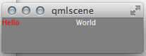
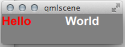

Stylesheets for QML
===================

This project contains classes and types which allow to use CSS like styling
in QML applications.  This involves multiple parts:

  * a simple CSS style sheet parser
  * a simple cascading style resolution engine
  * a QML extension plugin providing attached properties and QML types
    loading style sheets and requesting values for QML properties

Introduction
------------

Let's start with a small example.

    import QtQuick 2.3
    import QtQuick.Layouts 1.1

    import Aqt.StyleSheets 1.1                                            // [1]

    Rectangle {
        width: 200
        height: 50

        StyleEngine {                                                     // [2]
            styleSheetSource: "HelloWorld.css"
            defaultStyleSheetSource: "default.css"                        // [2b]
        }

        StyleSet.name: "root"                                             // [3]
        color: StyleSet.props.color("background-color")                   // [4]

        RowLayout {
            Rectangle {
                StyleSet.name: "box"                                      // [5]
                width: 100
                Text {
                    text: "Hello"
                    color: StyleSet.props.color("text-color")             // [6]
                    font: StyleSet.props.font("font")                     // [7]
                }
            }

            Item {
                StyleSet.name: "box"
                width: 100
                Text {
                    text: "World"
                    color: StyleSet.props.color("text-color")
                    font: StyleSet.props.font("font")
                }
            }
        }
    }

There are some things going on here:

1. Import `Aqt.StyleSheets` to get the necessary stuff.

2. Setup the style engine.  You have to do this exactly once in your
   application (you will get warnings, if you try to set up more than one
   style engine), and pass it url of the style sheet to use
   (`styleSheetSource`).  Currently this can only be a local file url.
   This property is dynamic, so if you change its values during runtime the
   style engine will reset itself to the style sheet.  It will will also
   watch the specified file, i.e. if you go to change it while the
   application is running it will automatically reload it and send property
   changes to all style listeners.

   The `defaultStyleSheetSource` property defines a second stylesheet,
   which has a lower weight than the one set with the `styleSheetSource`
   property.  Its purpose is to define the "default" or "fallback"
   definitions for properties.

3. Specify a style classname to owning instance (here the outer
   `Rectangle`).  See below.

4. Bind a style sheet property to a QML property.  Here the stylesheet
   property `background-color` is bound to the outer rectangles `color`
   property.  Which style sheet rule's `background-color` property is
   actually bound is decided by the selector resolution system.  See below.

5. Same as [3], but here the style classname is set to the inner
   `Rectangle` instance.

6. Again, bind a style property `text-color` to `Text`'s color property.

7. This binds a `font` style property to the `font` property of the text
   element.  `font()` on `StyleSet.props` will return a proper `QFont`
   object, so no need for adjusting font strings anymore.

Now let's see how a style sheet could look like:

    .root {
      background-color: "gray";
    }

    QQuickText {
        text-color: "white";
    }

    QQuickRectangle > QQuickText {
        text-color: "red";
    }

Now running this would give:

So how is this working?

The `StyleSet` attached property maintains a path for each object it is
attached to.  This path is build from the *type name* and the *style class
name(s)* (as set by the attached StyleSet.name property) of each item from
the element attached to until the root of application.  You can show the
path for each element using the `StyleSet.path` attached property, e.g. by
adding a line like this to an element:

    Component.onCompleted: console.log("Path:", StyleSet.path)

If you put this into the Text elements in the example above you get:

    Path: QQuickRectangle.root/QQuickRowLayout/QQuickItem.box/QQuickText
    Path: QQuickRectangle.root/QQuickRowLayout/QQuickRectangle.box/QQuickText

The type name is the typeName as QML will report it.  For base QtQuick
classes this is something like `QQuickRectangle`, `QQuickText`,
`QQuickItem`, etc.  For custom, user build types this is the same name as
you would use in QML code.  I.e. a type defined in the file `FooBar.qml`
would be `FooBar`.

The style class name is empty by default, but can be set with
`StyleSet.name` attached property.

When style property bindings are resolved these element paths are matched
against the selector rules from the loaded style sheet(s)
(e.g. `QQuickRectangle > QQuickText`).  The precedence rules in this style
engine work similar to CSS, but are simpler (because at lot of details are
not supported).  Simply put the rules are:

  1. The most specific rule wins;

  2. If two rules are ambiguous in the style sheet the rule with the
     highest *specificity* wins(*);

  3. If two rules have the same specificity the one defined last in a
     source file wins;

  4. A definition in the user style sheet (set with `styleSheetSource`
     property) overrules the one in the default stylesheet (set with
     `defaultStyleSheetSource` property).

(*) The *specificity* for a element path is computed by counting the number
of parts matching in selectors.  This engine knows about two kinds of
things to match: *typenames* and *stylenames*.  Each *typename* matching
with a selector rule increases the typename specificity, each *stylename*
the style specificity.  A element path "Foo.root/Bar" matching a rule "Foo
Bar" has therefore the specificity `[2,0]`.  If matching a selector
`Foo.root Bar" the specificity would be `[2,1]`.  If this sounds confusing
read about CSS specificity in the net; this engine supports only the lower
two values.

From the example above we can see:

  * `QQuickRectangle > QQuickText` is more specific than the very generic
    `QQuickText` rule.  It matches exactly one element.  (If you would add
    a rule `QQuickRectangle QQuickText` this would seem to be less specific
    than the `QQuickRectangle > QQuickText` rule, but is not, it has indeed
    exactly the same specificity).

  * There is no `font` property in the style sheet so the system is using
    some fallback - it will most likely complain (if there is no `font`
    property in the default stylesheet).

Add the following rule to the style sheet:

    .box {
      font: "bold 20px Arial";
    }

With this the inner `Rectangle` and `Item` will get a specific font
setting.  Though neither of these containers use the property, the property
will nevertheless be *inherited* by their contained `Text` elements.  And
thus the result will be:

Types you're probably interested in when using this
---------------------------------------------------

When working with this in QML you should know how the types `StyleEngine`
and `StyleSet` are behaving.  The rest of the classes are internal types
mostly, which you probably never have to know about.

  * [StyleEngine](@ref aqt::stylesheets::StyleEngine) the access to the
    style engine singleton.
  * [StyleSet](@ref aqt::stylesheets::StyleSet) the attached type giving
    access to the element path (aqt::stylesheets::StyleSet::path), the
    resolved style properties (aqt::stylesheets::StyleSet::props), and
    the style class name property (specific
    aqt::stylesheets::StyleSet::name), and the style properties.

Implementing a style sheet chooser
----------------------------------

See here [StyleSheetMenu](@ref StyleSheetMenu)
